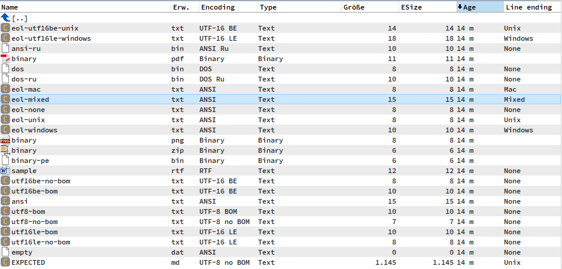

# Text Line




A **content (WDX) plugin for [Total Commander](https://www.ghisler.com/)** that
exposes individual lines of a text file as content fields — usable in custom
columns, the search dialog, tooltips, and multi-rename.

- Original by Alexey Fomin (`http://ledsoft.narod.ru`)
- Lazarus/FPC port + extensions (32/64-bit, last-line & line-count fields,
  automatic Unicode and line-ending detection, `SkipEmpty`)

---

## Fields

| Field         | Meaning                                   | Type    |
|---------------|-------------------------------------------|---------|
| `1` … `10`    | Line 1 to 10, counted from the top        | text    |
| `-3`          | Third line from the end                   | text    |
| `-2`          | Second line from the end                  | text    |
| `-1`          | Last line of the file                     | text    |
| `Line count`  | Total number of lines                     | numeric |
| `Encoding`    | Detected text encoding or binary data     | text    |
| `Type`        | Folder, binary file, or text file          | choice  |
| `Line ending` | Detected line-ending convention            | text    |
| `Language`    | Best matching language (on request)         | text    |

The line fields (`1` … `10`, `-3`, `-2`, `-1`) expose these **units**:

| Unit  | Meaning                                                      |
|-------|--------------------------------------------------------------|
| `auto` | Automatic source-codepage detection using the native Ude Pascal port (default) |
| `cp1251` | Windows Cyrillic |
| `cp1253` | Windows Greek |
| `cp866` | DOS Cyrillic |
| `cp737` | DOS Greek |
| `win` | Interpret legacy single-byte text as the system **ANSI** code page |
| `dos` | Interpret legacy single-byte text as the system **OEM (DOS)** code page |
| `cp1255` | Windows Hebrew |
| `cp1252` | Windows Western European (explicit selection) |

For detected UTF-8 and UTF-16 files all units return the same Unicode text.
The unit selects the source codepage only for legacy single-byte files;
output is always Unicode, including in tooltips. No additional file reads or
codepage heuristics are needed for explicitly selected codepages.

`auto` is the first unit (index 0) and the default for unqualified line fields.
`cp1252` is now at index 8; these two units have exchanged indices. All other
unit indices (1..7) are unchanged. Integrations passing numeric unit indices
must update their former CP1252/auto selections. For files using the system
codepage, explicitly select `win` or `dos`.

### Automatic codepage selection

Ude detection runs for a legacy text file when `Encoding` or an `auto` line
field (including an unqualified/default line field) is requested. Both share
the same result: requesting Encoding then lines, or lines then Encoding, never
runs Ude twice for the cached file version. If Ude is uncertain, a native
language-marker detector supplies a second-stage codepage candidate. Explicit codepage units, `Type`,
`Line ending` and `Line count` do not invoke it. Already detected UTF-8/UTF-16,
binary files and RTF bypass Ude. Detection uses only the cached head (at most
64 KiB), with no additional file-data reads. The cache is a single entry;
switching to another file and back can require detection again.

`AutoConfidencePercent` in `[Encoding]` is the minimum accepted Ude confidence
on a 0..100 scale (default 80), shared with `Encoding`. Values are clamped to
this range; invalid values use 80. Below the threshold, or when detection fails,
the second stage is tried. If neither stage is accepted, `Encoding` returns
`UnknownEncoding` (default `Unknown`). This is a display
label, not a fallback codepage; blank labels use `Unknown`. For line decoding,
`auto` falls back to `cp1252` when uncertain or no suitable Windows decoder is
available. A confidently detected charset can still be reported by Encoding
even if Windows cannot decode it. Confidence is a statistical
model score, not a guaranteed probability of correctness. Short, ambiguous
texts may need an explicit codepage. CP737 is not detected by upstream Ude.

The port includes Ude's Cyrillic, Greek, Hebrew, Western, CJK and escape
detectors. See [the port notes](Src/Ude/README.md) for supported mappings,
buffer API differences and license information. The plugin has no .NET
dependency. Detection adds CPU work only when `Encoding` or `auto` needs a new legacy-file
result; selecting a different unit does not modify the raw line cache.

The second stage uses the 40-language word-marker models from
[Detect-File-Encoding-And-Language](https://github.com/gignupg/Detect-File-Encoding-And-Language),
ported natively to Pascal under MIT. `LanguageConfidencePercent` (0..100,
default 80, invalid values use 80) controls acceptance of its encoding guess,
independently of Ude's score. Accepted second-stage codepages include `CP 1250` through
`CP 1257`, e.g. Turkish `CP 1254` and Arabic/Persian `CP 1256`. No additional file
data is read; this stage and the Language field share one cached result.

### Language

Use `[=TextLine.Language]` in a Total Commander column or tooltip. The new field
is appended at index 17 without changing existing field indices. It returns the
detector's English name with an uppercase initial, e.g. `German`, `Turkish`,
`Arabic`, `Russian` or `Chinese-traditional`. With no marker matches it uses the
accepted codepage's conventional principal language where a mapping exists,
e.g. CP 1254 -> Turkish, CP 1255 -> Hebrew, CP 866 -> Russian. This fallback is
not a detected language: these codepages can also be used for related languages.
Multilingual Western/Central-European/Baltic and Unicode codepages have no
single language fallback and return `Unknown`. The CP1252 decoding fallback
never counts as a recognized codepage. Binary
files, RTF and folders return no value. Language names are guesses, not proof.

On securely recognized files, language analysis runs only when Language is
requested. Unicode/securely Ude-decoded content uses Unicode language patterns.
If the detector already ran as the necessary second encoding stage, Language
simply returns that cached result. The field reports the best matching language
even if its score is below `LanguageConfidencePercent`; that cutoff applies only
to choosing an encoding. More languages do not imply detection of every codepage:
CP737 remains unsupported. Longer coherent prose is more reliable than tiny,
structured or mixed-language files. See [port notes](Src/Language/README.md).

---

## Encoding

The encoding of each file is **detected automatically**:

- UTF-8 — with or without BOM
- UTF-16 little-endian and big-endian — with or without BOM
- otherwise legacy single-byte text (source codepage selected by the unit)

Non-ASCII characters are returned correctly as Unicode when the selected
source codepage matches the file. Explicit line-field units override automatic
selection without changing the shared detection result.

The `Encoding` field reports `UTF-16 LE`, `UTF-16 BE`, `UTF-8 BOM`,
`UTF-8 no BOM`, `RTF`, `Binary`, or a normalized Windows codepage name such as
`CP 20127` (ASCII), `CP 1251`, `CP 1255`, `CP 866`, `CP 20866` (KOI8-R), or
`CP 28597` (ISO-8859-7). Both detection stages use the same `CP XXXX` notation.
An accepted charset without an interchangeable Windows codepage (e.g. EUC-TW)
retains its charset name. UTF-8/UTF-16 keep their existing labels/BOM information.
Unknown or
uncertain text (including empty files) returns the configurable label `Unknown`.
The former `ANSI`/`ANSI Ru`/`DOS`/`DOS Ru` byte-range heuristics have been removed.
Their Oem*/Rus* INI keys are ignored. `Encoding` is now a Unicode text field
instead of a multiple-choice field, allowing arbitrary charset names and a
Unicode unknown label; existing searches for old labels need updating.
`Type` reports `Folder`, `Binary`, or `Text`. Detection reuses the cached header
and never requires a separate file read.

`Type`, `Encoding`, `Language`, and `Line ending` work independently of the `Extensions`
filter. Classification is lazy; Ude does not add work to explicit-codepage or
line-count queries.

## Line endings

For text files, `Line ending` offers three selectable display formats. Each
format names the same detected delimiter consistently:

| Delimiter | `Chars` | `OS` | `Legacy` |
|---|---|---|---|
| CRLF (`\r\n`) | `CRLF` | `Win` | `DOS` |
| LF (`\n`) | `LF` | `Linux` | `UNIX` |
| CR (`\r`) | `CR` | `Mac` | `OS-9` |
| More than one style | `Mix` | `Mix` | `Mix` |
| No complete delimiter | `None` | `None` | `None` |

Choose `Chars`, `OS`, or `Legacy` as the field unit in Total Commander. The
default (`Chars`) is unambiguous and describes the actual bytes/code units;
the other two formats are nomenclature aliases only and do not change the
detection.

The field is calculated only when explicitly requested. It scans the same
cached header used for type and encoding detection (at most 64 KiB), so it
does not read any additional file data. UTF-8, legacy single-byte text, and
UTF-16 LE/BE are handled without converting the complete file. Binary files
and folders return an empty field.

For files larger than 64 KiB, the result describes the cached header. A CR at
the exact end of a partial header is not counted as `CR`, because its matching
LF may be the next byte outside the cache. The `CR` / `Mac` / `OS-9`
classification is detection metadata; the existing line fields continue to
use LF as their primary line separator.

---

## Configuration

Settings live in **`TextLine.ini`**, next to the plugin. Without a settings
file the plugin handles **all files** and replaces nothing.

```ini
[Options]
; Space-separated list of handled extensions; empty = all files.
Extensions=txt ini inf

; Skip empty (whitespace-only) lines.
SkipEmpty=0

[Encoding]
; Minimum confidence shared by Encoding and auto line decoding (0..100).
AutoConfidencePercent=80
; Minimum confidence for the language-based second encoding stage (0..100).
LanguageConfidencePercent=80
; Encoding label for unknown/uncertain text. Empty values use Unknown.
UnknownEncoding=Unknown
; Binary/Unicode detection buffers are KiB (maximum 64).
TextBufferSizeKB=1
Utf8BufferSizeKB=64
BinaryIgnore=

[Replaces]
; Rules of the form  S<n>=<search>=<replacement>  (S1..S20).
; Remove "***":          S1=***=
; Replace "test"->"demo": S2=test=demo
S1=
```

### Replacement rules and escaping (planned)

Replacement rules use the form:

```ini
S<n>=<search>=<replacement>
```

The first unescaped `=` separates the search text from the replacement. A
backslash escapes characters which would otherwise be ambiguous:

| Sequence | Literal character |
|----------|-------------------|
| `\=`     | `=`               |
| `\\`    | `\`               |
| `\"`    | `"`               |

Examples:

```ini
[Replaces]
; Replace "=" with ":".
S1=\==:

; Replace "\" with "/".
S2=\\=/

; Replace a double quote with an apostrophe.
S3=\"='

; Replace "a" with "=", "\", or a double quote.
S4=a=\=
S5=a=\\
S6=a=\"

; Remove "=".
S7=\==
```

Escaping is decoded in both the search and replacement parts. Additional
unescaped `=` characters after the separator remain part of the replacement,
so existing rules continue to work. Unknown sequences such as `\T` and a
backslash at the end of a value remain literal backslashes; Windows paths such
as `C:\Temp` therefore do not need to be rewritten. Rules without a separator
or with an empty search text are ignored.

### `SkipEmpty`

When set to `1`, empty (whitespace-only) lines are ignored:

- `1` … `10` return the first 10 **non-empty** lines from the top,
- `-3` / `-2` / `-1` return the last non-empty lines from the bottom,
- `Line count` counts only non-empty lines.

---

## Performance

- Results are cached per file (keyed by name, size and timestamp); repeated
  field queries for the same file are served from memory.
- The line result groups and the `Type`, `Encoding`, and `Line ending`
  metadata are built **lazily and independently**. Asking only for line 1 does
  not calculate unrequested metadata, read the tail, or count the lines.
- `Line ending` scans only the already cached header (at most 64 KiB) and does
  not cause another read.
- Large files are **not** read in full for the line fields: only a head / tail
  window is scanned (widened automatically if needed).
- `Line count` streams the file once — and only when the field is actually used.

---

## Thanks

- Christian Ghisler — for Total Commander
- Alexey Torgashin — for the File Descriptions source
