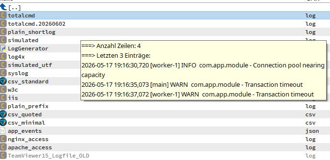

# Text Line

A **content (WDX) plugin for [Total Commander](https://www.ghisler.com/)** that
exposes individual lines of a text file as content fields — usable in custom
columns, the search dialog, tooltips, and multi-rename.

- Original by Alexey Fomin (`http://ledsoft.narod.ru`)
- Lazarus/FPC port + extensions (32/64-bit, last-line & line-count fields,
  automatic Unicode detection, `SkipEmpty`)



---

## Fields

| Field         | Meaning                                   | Type    |
|---------------|-------------------------------------------|---------|
| `1` … `10`    | Line 1 to 10, counted from the top        | text    |
| `-3`          | Third line from the end                   | text    |
| `-2`          | Second line from the end                  | text    |
| `-1`          | Last line of the file                     | text    |
| `Line count`  | Total number of lines                     | numeric |
| `Encoding`    | Detected text encoding or binary data     | choice  |
| `Type`        | Folder, binary file, or text file          | choice  |

The text fields expose two **units**:

| Unit  | Meaning                                                      |
|-------|--------------------------------------------------------------|
| `win` | Interpret legacy single-byte text as the system **ANSI** code page |
| `dos` | Interpret legacy single-byte text as the system **OEM (DOS)** code page |

For Unicode files both units return the same correct text.

---

## Encoding

The encoding of each file is **detected automatically**:

- UTF-8 — with or without BOM
- UTF-16 little-endian and big-endian — with or without BOM
- otherwise legacy single-byte text (ANSI / OEM, selected by the unit)

Non-ASCII characters are returned correctly as Unicode.

The `Encoding` field reports `UTF-16 LE`, `UTF-16 BE`, `UTF-8 BOM`,
`UTF-8 no BOM`, `ANSI`, `ANSI Ru`, `DOS`, `DOS Ru`, `RTF`, or `Binary`,
matching EncInfo's naming. `Type` reports `Folder`, `Binary`, or `Text`.
Detection reuses the small cached header and never requires a separate file
read. The DOS and Russian heuristics run only when `Encoding` is requested.

`Type` and `Encoding` work independently of the `Extensions` filter. Their
classification is lazy and does not add work to ordinary line or line-count
queries.

---

## Configuration

Settings live in **`TextLine.ini`**, next to the plugin. Without a settings
file the plugin handles **all files** and replaces nothing.

```ini
[Options]
; Space-separated list of handled extensions; empty = all files.
Extensions=txt ini inf

; Skip empty (whitespace-only) lines.
SkipEmpty=0

[Encoding]
; EncInfo-compatible defaults; buffer sizes are KiB (maximum 64).
TextBufferSizeKB=1
Utf8BufferSizeKB=64
BinaryIgnore=
OemEnabled=1
OemBufferSizeKB=1
OemPercent=18
OemIgnore=AB BB
RusEnabled=1
RusBufferSizeKB=2
RusMinSize=8
RusPercent=30
RusWordLen=0

[Replaces]
; Rules of the form  S<n>=<search>=<replacement>  (S1..S20).
; Remove "***":          S1=***=
; Replace "test"->"demo": S2=test=demo
S1=
```

### `SkipEmpty`

When set to `1`, empty (whitespace-only) lines are ignored:

- `1` … `10` return the first 10 **non-empty** lines from the top,
- `-3` / `-2` / `-1` return the last non-empty lines from the bottom,
- `Line count` counts only non-empty lines.

---

## Performance

- Results are cached per file (keyed by name, size and timestamp); repeated
  field queries for the same file are served from memory.
- The three result groups — top lines, bottom lines, line count — are built
  **lazily and independently**: asking only for line 1 never reads the tail or
  counts the lines.
- Large files are **not** read in full for the line fields: only a head / tail
  window is scanned (widened automatically if needed).
- `Line count` streams the file once — and only when the field is actually used.

---

## Building

Open **`Src/TextLine.lpi`** in [Lazarus](https://www.lazarus-ide.org/) and build:

| Build mode | Output           | Total Commander |
|------------|------------------|-----------------|
| `Win32`    | `TextLine.wdx`   | 32-bit          |
| `Win64`    | `TextLine.wdx64` | 64-bit          |

Copy the resulting `.wdx` / `.wdx64` (and `TextLine.ini`) into a plugin folder
and install it via Total Commander's configuration
(*Configuration → Options → Plugins → Content plugins*).

---

## Project layout

```
Src/
  TextLine.lpr     library main unit (FPC/Lazarus)
  TextLine.lpi     Lazarus project (Win32 + Win64 build modes)
  ContPlug.pas     Total Commander content-plugin interface
  SProc.pas        small string / INI helpers
TextLine.ini
tests/
  create_test_files.ps1  reproducible encoding/binary fixtures
  wdx_smoke.ps1          32/64-bit WDX smoke test
  wdx_performance.ps1    cached before/after performance comparison
tests-files/             generated fixtures and expected results
README.md
```

---

## Thanks

- Christian Ghisler — for Total Commander
- Alexey Torgashin — for the File Descriptions source
